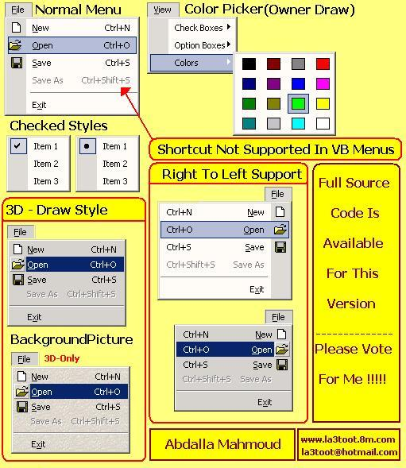



## Boody Menus

### Description

This is a great menu engine which will give you free control on your

applications menus .. No DLLs or OCXs You can just use it's

classes-modules directly ..

>>PLEASE VOTE FOR ME

>>What does this class do ?

- Add \ Remove unlimited menus at run time

- Modify standard properties for VB \ Non-VB menus

- Put icons\radio-check-style in menus

- Set font, BackColor,ForeColor .etc for 3D style menus

- Set a picture as a background for your menus

- Make Office-XP style menus

- Make your own style menus

- Get events (Click-Highlight-etc) for menus

- Make menus break

- Set one shortcut or more for a menu

- Midify shortcut(s) at run time

- Custmize shortcuts dialog

- Save\Load menus' shortcuts from a specified file

- Create menus without forms to make a pop-up menus

- Advanced PopupMenu function

- HelpText\Tag\OwnerDrawID\OwnerDrawData to store info for menus
 
### More Info
 

             |
---                |---
**Submitted On**   |2003-12-10 06:14:02
**By**             |[Abdalla Mahmoud](https://github.com/Planet-Source-Code/PSCIndex/blob/master/ByAuthor/abdalla-mahmoud.md)
**Level**          |Advanced
**User Rating**    |4.7 (345 globes from 73 users)
**Compatibility**  |VB 6\.0
**Category**       |[Custom Controls/ Forms/  Menus](https://github.com/Planet-Source-Code/PSCIndex/blob/master/ByCategory/custom-controls-forms-menus__1-4.md)
**World**          |[Visual Basic](https://github.com/Planet-Source-Code/PSCIndex/blob/master/ByWorld/visual-basic.md)
**Archive File**   |[Boody\_Menu16824012102003\.zip](https://github.com/Planet-Source-Code/abdalla-mahmoud-boody-menus__1-50400/archive/master.zip)

